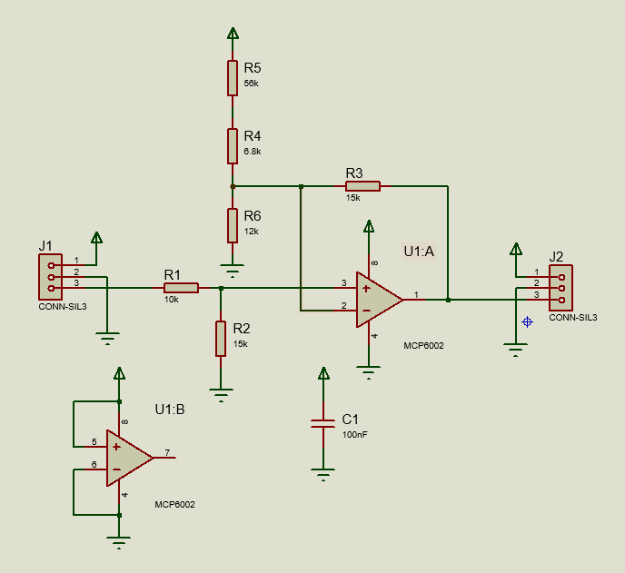
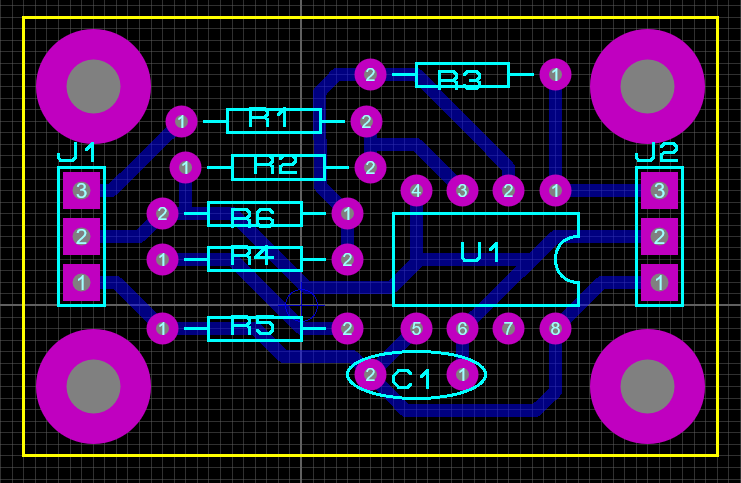
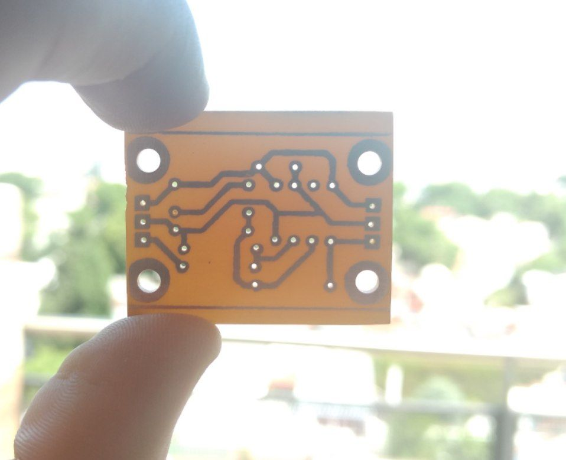
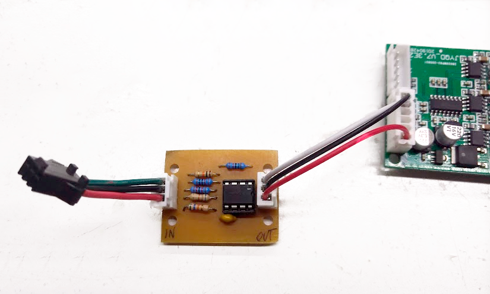

# ebike-throttle-fix
Adapter for connecting a hall effect sensor throttle to a JYQD v7.3e2 brushless driver board

Basically uses an opamp to shift a 0.8-4.2V signal into a 0-5V one.

- LTSpice simulation can be found in the `simulation` folder (`MCP6001.lib` file is licensed by Microchip)
- PCB (and schematic) editable in Proteus can be found in the `pcb` folder

